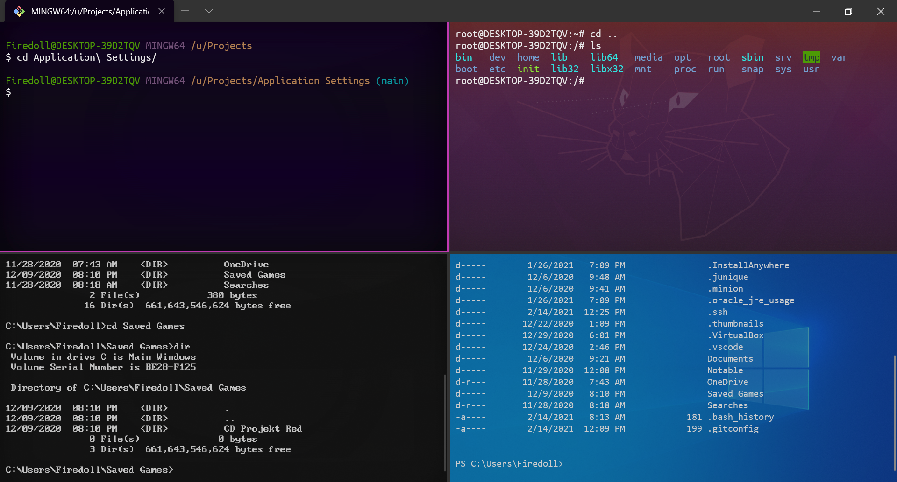

# Windows Dev Environment Settings

Developer configuration is a personal thing and this is my base configuration when working on Windows machines. 

## Fonts

Certain fonts are expected to be installed. They are packaged in this repo:

1. Open Fonts, select all, right click and install

⭐ Special thanks to [int10h](https://int10h.org/oldschool-pc-fonts/), a project I love.

## VS Code

1. Open this project in VS Code, 
2. Install the recommended extentions
3. Open the VS Code user `settings.json` and copy the content's of this repo's `.vscode/settings.json` in to yours. Or, pick and choose.

## Windows Terminal

Note: This assumes WSL is enabled, Ubuntu LTS (20) is installed, and GitBash is installed.

1. Copy the `Terminal Images` folder to `%USERPROFILE%/Pictures/Terminal Images` 
2. Open the settings with `Ctrl`+`,`.
3. Paste in the the contents of `Windows Terminal/settings.json`
4. Replace any file references, mine will not be correct. I've left common alternative locations for files commented out, although I'm not convinced %USERPROFILE% always works in here.
    - I use an abnormal directory structure on my PC where Users and 3rd party software have dedicated drives/partitions. You're files probably exist in the default locations.

## TODO:
- [Fix "visual bell"](https://github.com/microsoft/terminal/issues/7200) in GitBash
- Configure GitBash to autostart ssh agent (`eval `ssh-agent -s`?) or choose a simpler SSH solution.
